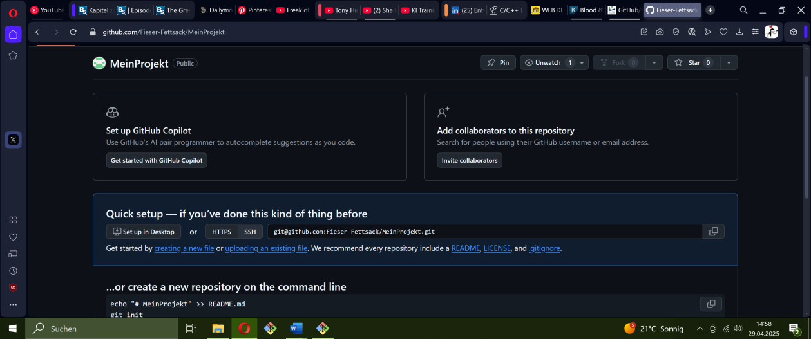
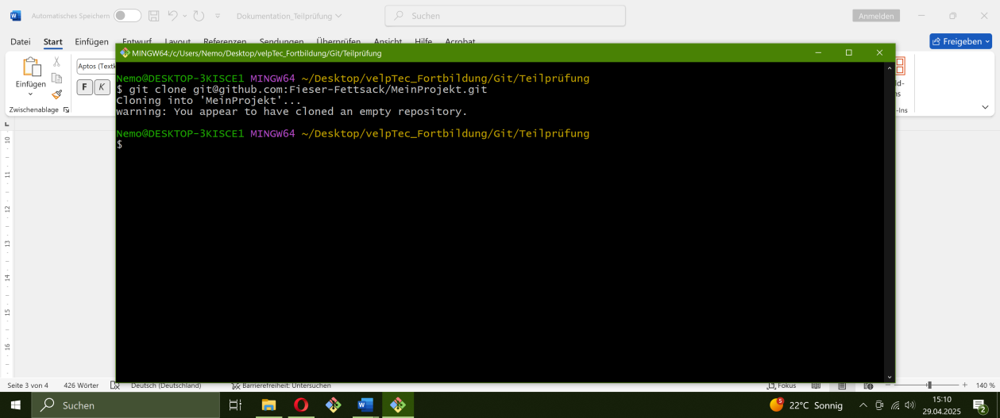
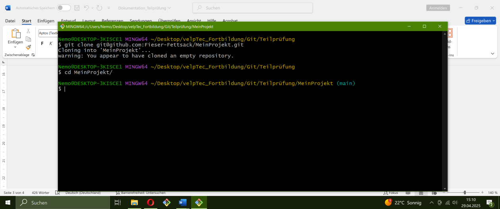
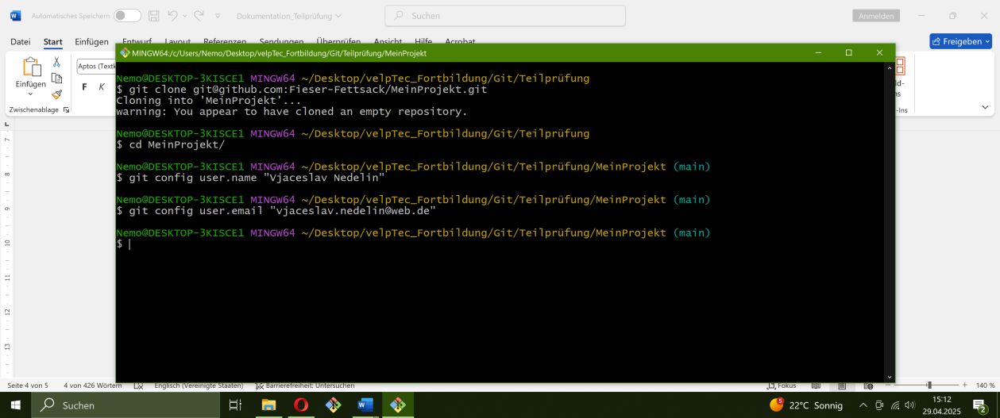
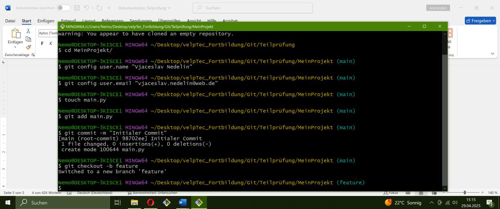
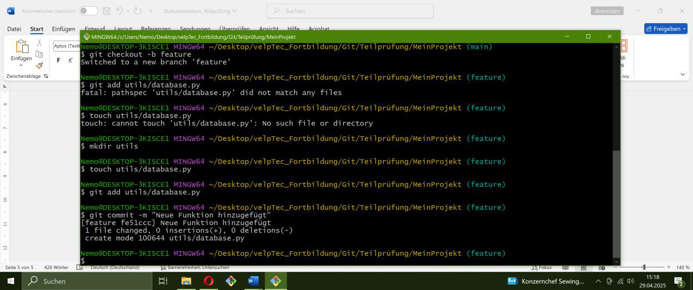
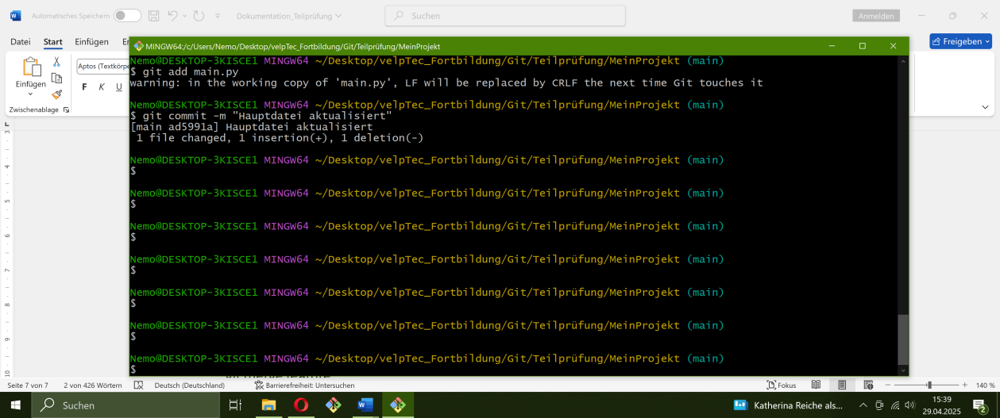

Dokumentation der Teilprüfung 1 

1. Gehe zu GitHub (www.github.com) und melde dich mit deinem Benutzerkonto an. 
Falls du noch kein Konto hast, registriere dich kostenlos.

	Benutzerkonto war bereits vorhanden
	

2. Nach dem Login klicke auf "+ New" (oben rechts) und erstelle ein neues leeres Repository mit dem Namen "MeinProjekt".
 
	
 
3. Notiere dir die URL des erstellten Repositories, sie wird später benötigt.

	Profil URL "git@github.com:Fieser-Fettsack/MeinProjekt.git"
	
 
4. Öffne dein Terminal (Linux/Mac) oder Git Bash (Windows).
 
	
 
5. Überprüfe, ob du bereits einen SSH-Schlüssel hast, indem du den folgenden Befehl ausführst: 

	ls ~/.ssh/
	
	
 
6. Falls die Ausgabe Dateien wie id_rsa und id_rsa.pub enthält, hast du bereits einen SSH-Schlüssel. 
In diesem Fall kannst du zu Teil 8 springen. 
	
	SSH-Schlüssel sind schon vorhanden
	
7. Der Befehl wird dich nach dem Speicherort des Schlüssels fragen und optional nach einem Passwort. 
Du kannst den Standard-Speicherort akzeptieren und ein Passwort festlegen oder es leer lassen (kein Passwort).
	
	Übersprungen 

8. Gehe in deinem Terminal zu dem Verzeichnis, in dem du dein lokales Git-Repository erstellen möchtest.

	Aktuelles Verzeichnis  "C:\Users\Nemo\Desktop\velpTec_Fortbildung\Git\Teilprüfung"
	
9. Klone das GitHub-Repository "MeinProjekt" 

	git clone git@github.com:Fieser-Fettsack/MeinProjekt.git
	

10. Navigiere in das geklonte Verzeichnis "MeinProjekt"

	cd MeinProjekt/
	
	
	
11. Konfiguriere Git mit deinem Namen und E-Mail, die mit GitHub verknüpft sind
	
	git config user.name "Vjaceslav Nedelin"
	
	git config user.email "Vjaceslav Nedelin@web.de"
	
	
	
12. Füge eine neue Datei hinzu (z. B. "main.py") und erstelle einen Initial-Commit:

	git add main.py
	git commit -m "Initialer Commit"
	
	
13. Erstelle einen neuen Branch mit dem Namen "feature"

	git checkout -b feature
	
	
	
14. Füge eine weitere Datei hinzu (z. B. "utils/database.py") und erstelle einen Commit auf dem "feature"-Branch:

	mkdir utils
	
	touch utils/database.py
	
	git add utils/database.py
	
	git commit -m "Neue Funktion hinzugefügt"
	
	
	
15. Bearbeite die Datei "main.py" und führe einen Commit auf dem "feature"-Branch durch:

	echo 'print("ByeBye, World")' > main.py

	git add main.py
	
	git commit -m "Hauptdatei aktualisiert" 
	
	

16. Wechsle zurück zum "main"-Branch

	git checkout main
	
	
	
17. Bearbeite die Datei "main.py" und führe einen Commit auf dem "main"-Branch durch:

	echo 'print("Hello, World")' > main.py
	
	git add main.py
	
	git commit -m "Hauptdatei aktualisiert"
	
	
 
18. Versuche nun den "feature"-Branch in den "main"-Branch zu mergen:

	git merge feature
	
	
	
	
	
	
	git commit -am "Commit nach Bereinigung des Konflikts"
	
	touch README.md
	
	#Dokumentation zur RREADME.md hinzugefügt 
	
	git add -A
	
	git commit -m "README Dokumentation hinzugefügt"
	
	git push -u origin main
 
 
 
