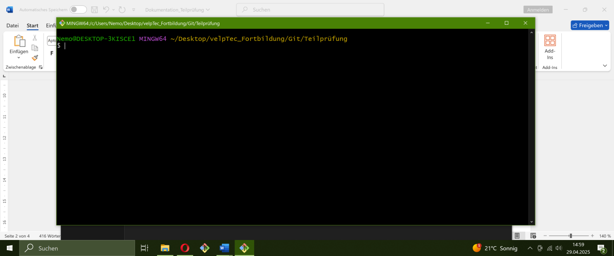

Dokumentation der Teilprüfung 1 

1. Gehe zu GitHub (www.github.com) und melde dich mit deinem Benutzerkonto an. 
Falls du noch kein Konto hast, registriere dich kostenlos.

	Benutzerkonto war bereits vorhanden
	

2. Nach dem Login klicke auf "+ New" (oben rechts) und erstelle ein neues leeres Repository mit dem Namen "MeinProjekt".
 
	
 
3. Notiere dir die URL des erstellten Repositories, sie wird später benötigt.

	Profil URL: git@github.com:Fieser-Fettsack/MeinProjekt.git
	
 
b) SSH-Schlüssel erstellen: 
4. Öffne dein Terminal (Linux/Mac) oder Git Bash (Windows).
 
	
 
5. Überprüfe, ob du bereits einen SSH-Schlüssel hast, indem du den folgenden Befehl ausführst: ls ~/.ssh/
 
6. Falls die Ausgabe Dateien wie id_rsa und id_rsa.pub enthält, hast du bereits einen SSH-Schlüssel. In diesem Fall kannst du zu Teil 3 springen. Wenn die Dateien nicht existieren, erstelle einen neuen SSH-Schlüssel mit dem folgenden Befehl: bash ssh-keygen -t rsa -b 4096 -C "deine_email@beispiel.com" Beachte, dass "deine_email@beispiel.com" durch deine GitHub-E-Mail-Adresse ersetzt werden muss.
SSH-Schlüssel sind schon vorhanden
7. Der Befehl wird dich nach dem Speicherort des Schlüssels fragen und optional nach einem Passwort. Du kannst den Standard-Speicherort akzeptieren und ein Passwort festlegen oder es leer lassen (kein Passwort).
Übersprungen
c) Lokales Repository einrichten und Workflow: 
8. Gehe in deinem Terminal zu dem Verzeichnis, in dem du dein lokales Git-Repository erstellen möchtest.
Bin schon da : C:\Users\Nemo\Desktop\velpTec_Fortbildung\Git\Teilprüfung
9. Klone das GitHub-Repository "MeinProjekt" mit dem folgenden Befehl: bash git clone git@github.com:DeinBenutzername/MeinProjekt.git .Ersetze "DeinBenutzername" durch deinen GitHub-Benutzernamen. Der Befehl klont das Repository auf deinen lokalen Rechner.

10. Navigiere in das geklonte Verzeichnis "MeinProjekt":
cd MeinProjekt
 
11. Konfiguriere Git mit deinem Namen und E-Mail, die mit GitHub verknüpft sind:
git config user.name "Dein Name"
git config user.email "deine_email@beispiel.com"
Ersetze "Dein Name" und "deine_email@beispiel.com" durch deine echten Daten.
 
12. Füge eine neue Datei hinzu (z. B. "main.py") und erstelle einen Initial-Commit:
git add main.py
git commit -m "Initialer Commit"
 
13. Erstelle einen neuen Branch mit dem Namen "feature":
git checkout -b feature
 
14. Füge eine weitere Datei hinzu (z. B. "utils/database.py") und erstelle einen Commit auf dem "feature"-Branch:
git add utils/database.py
git commit -m "Neue Funktion hinzugefügt"

15. Bearbeite die Datei "main.py" und führe einen Commit auf dem "feature"-Branch durch:
git add main.py
git commit -m "Hauptdatei aktualisiert" 

16. Wechsle zurück zum "master"-Branch:
git checkout main
 
17. Bearbeite die Datei "main.py" und führe einen Commit auf dem "master"-Branch durch:
git add main.py
git commit -m "Hauptdatei aktualisiert"
 
18. Versuche nun den "feature"-Branch in den "master"-Branch zu mergen:
git merge feature
Beachte: Dieser Schritt ist absichtlich so gestaltet, dass ein Merge-Konflikt entsteht, da sowohl der "master"- als auch der "feature"-Branch Änderungen an der "main.py"-Datei vorgenommen haben.
 
 
 
 
